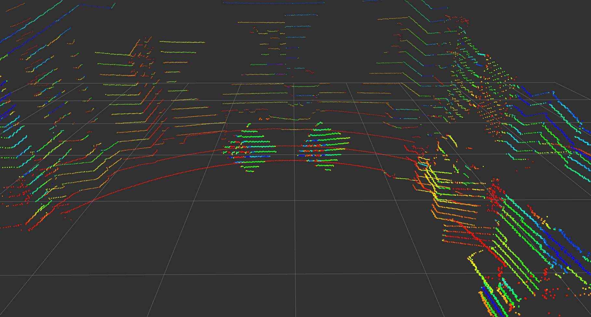
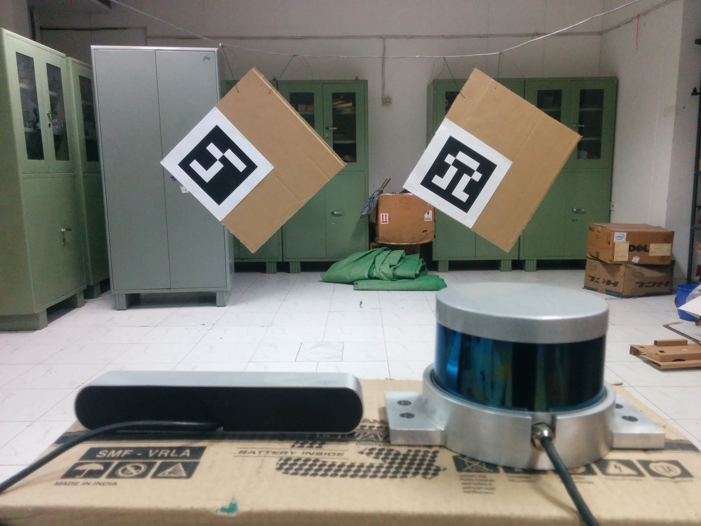
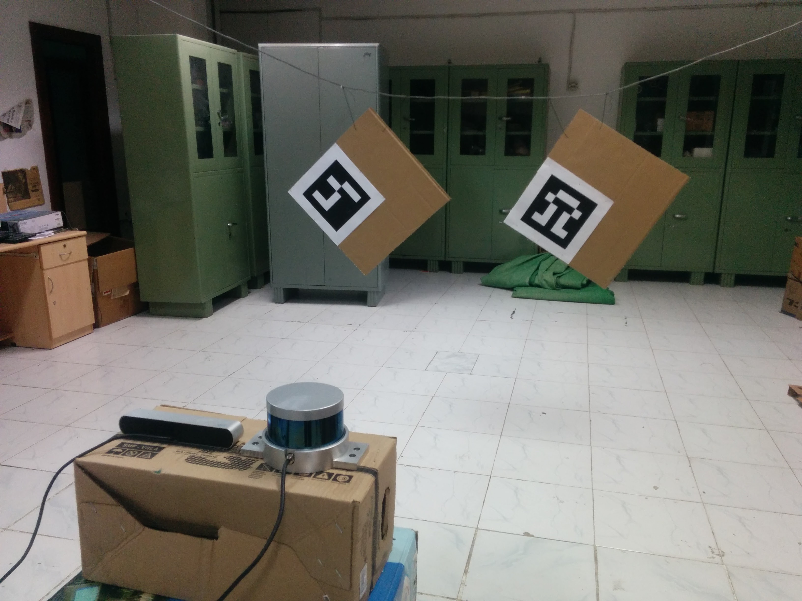
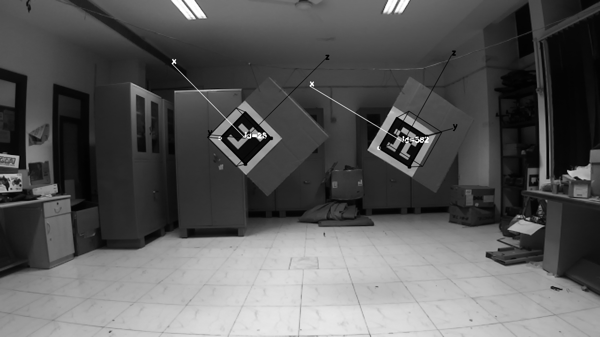

# ROS package to calibrate a camera and a LiDAR.



The package was used to calibrate a Velodyne VLP-16 LiDAR with a ZED Stereo camera. Point Gray Blackfly was also calibrated against VLP-16. Since, VLP-16 provides only 16 rings, we believe that the higher models of the Velodyne will also work well with this package.

The package uses `aruco_ros` and a slightly modified `aruco_mapping` as dependencies, both of which are available on this repository itself.


## Contents
1. [Setup](#setup)
2. [Getting Started](#getting-started)
3. [Usage](#usage)
4. [Future Improvements](#future-improvements)

## Setup
Prerequisites:

* [ROS](http://www.ros.org/)  
* [aruco_ros](https://github.com/pal-robotics/aruco_ros)  
* a slightly modified [aruco_mapping](https://github.com/SmartRoboticSystems/aruco_mapping)  

ROS package for the camera and LiDAR you wish to calibrate.  

Clone this repository to your machine.  
Put the three folders in `path/to/your/ros/workspace/src` and run `catkin_make`.

## Getting Started

 

There are a couple of configuration files that need to be specfied in order to calibrate the camera and the LiDAR. The config files are available in the `cross_sensor_calibration/conf` directory. The `find_velodyne_points.launch` file is available in the `cross_sensor_calibration/launch` directory.

### config_file.txt

>1280 720  
>-2.5 2.5  
>-4.0 4.0  
>0.0 2.5  
>0.05  
>2  
>0  
>611.651245 0.0        642.388357 0.0  
>0.0        688.443726 365.971718 0.0  
>0.0        0.0        1.0        0.0  

The file contains specifications about the following:

>image_width image_height  
>x- x+  
>y- y+  
>z- z+  
>cloud_intensity_threshold  
>number_of_markers  
>use_camera_info_topic?  
>fx     0       cx      0  
>0      fy      cy      0  
>0      0       1       0 

`x-` and `x+`, `y-` and `y+`, `z-` and `z+` are used to remove unwanted points in the cloud and are specfied in meters. The filtred point cloud makes it easier to mark the board edges. The filtered pointcloud contains all points   
(x, y, z) such that,  
x in [`x-`, `x+`]  
y in [`y-`, `y+`]  
z in [`z-`, `z+`]  

The `cloud_intensity_threshold` is used to filter points that have intensity lower than a specified value. The default value at which it works well is `0.05`. However, while marking, if there seem to be missing/less points on the cardboard edges, tweaking this value will might help.

The `use_camera_info_topic?` is a boolean flag and takes values `1` or `0`. The `find_velodyne_points.launch` node uses camera parameters to process the points and display them for marking. If you wish to use the `camera_info` topic to read off the parameters, set this to `1`. Else, the explicitly provided camera parameters in `config_file.txt` are used.

### marker_coordinates.txt

The ArUco markers are stuck on the board such that when it is hung from a corner, the ArUco marker is on the left side of the board.

After everything is setup, it should look something like this. Notice how the axis are aligned. `y-axis` should point outwards, `x-axis` along the `breadth (s2)` and `z-axis` along the `length (s1)`. The markers are also arranged so that the `ArUco id` are in ascending order.


After sticking the ArUco marker on a planar cardboard, it will look like this.


>2  
>48.4  
>46.8  
>4.0  
>5.0  
>20.5  
>49.0  
>46.8  
>4.0  
>5.0  
>20.5  

The first line specfies 'N' the number of boards being used. Followed by N*5 lines with the following information about the dimensions of the board:
>length (s1)  
>breadth (s2)  
>border_width_along_length (b1)  
>border_width_along_breadth (b2)  
>edge_length_of_ArUco_marker (e)  

All dimensions in `marker_coordinates.txt` are in centimeters.


### cross_sensor_calibration.yaml

>cross_sensor_calibration:  
>  camera_frame_topic: /frontNear/left/image_raw  
>  camera_info_topic: /frontNear/left/camera_info  
>  velodyne_topic: /velodyne_points

Contains name of camera and velodyne topics that the node will subscribe to.

### find_velodyne_points.launch

Parameters are required for the `aruco_mapping` node and need to be specfied here. Ensure that the topics are mapped correctly for the node to function.
Other parameters required are:  
* calibration_file(.ini format)    
* num_of_markers  
* marker_size(in meters)  

For more information about the `aruco_mapping` package refer to their [documentation](https://github.com/SmartRoboticSystems/aruco_mapping).

## Usage

Before launching the calibration node ensure that the ArUco markers are visible in the camera frame and the markers are arragned in ascending order of their `ArUco ids` (`ArUco ids` and their co-ordinate frame can be found/viewed by running the original `aruco_mapping` [package](https://github.com/SmartRoboticSystems/aruco_mapping)) from left to right as viewed by the camera.

The setup should look something like this.


Use the following command to start the calibration process once everything is setup.

```shell
roslaunch cross_sensor_calibration find_velodyne_points.launch
```

An initial [R|t] between the camera and the various ArUco markers will be estimated. Following this, a filtered point cloud (according to the specifications in the `config_file.txt`) will be displayed. The user needs to mark each edge of the rectangular board.

Each board will have 4 line segments and need to be marked from leftmost board to the rightmost board. Marking a line segment is quite straight-forward, one needs to draw a quadrilateral around the line being marked. Click and press a key to confirm the corner of the quadrilateral. Once 4 points are clicked, each followed by a key-press, the program will move on to the next line segment. Continue marking the line segments for all boards until complete.
Line segments for each board are to be marked in clock-wise order starting from the top-left.

After marking all the line-segments, the rigid-body transformation between the camera and the LiDAR frame will be displayed.

Intermediate values are logged in `conf/transform.txt` and `conf/points.txt`.

### transform.txt
This contains the tranformation from each ArUco marker's center to the camera center. Different markers are identified by their `ArUco ids`. The transform is represented by 3x1 vectors, `tvec` and `rvec`. `tvec` is in meters while `rvec` follows axis-angle representation. This file is written by the slightly modified `aruco_mapping` node. This node runs initially and writes the tranform values, after which the pointcloud is presented to the user for marking.

### points.txt
This contains `num_of_sensors*(num_of_markers*points_per_board)` 3D points, here, `num_of_sensors` is fixed to 2 and the `points_per_board`=4, the four corner points.  
So if `num_of_markers` = 2, then,  
* the first 4 points represent the first board,  
* next 4 points represent the second board,  
both of which are 3D co-ordinates in meters, viewed from the `lidar` origin.  
* the next 4 points represent the first board,  
* the next 4 points represent the second board,  
both of which are 3D co-ordinates in meters, viewed from the `camera` origin.  
The points are ordered according to their correspondences, i.e. the second point in the first 8 points has a correspondence with the second point in the last 8 points in this case.

## Future improvements

- [ ] automate process of marking line-segments
- [ ] iterative process with weighted average over multiple runs
